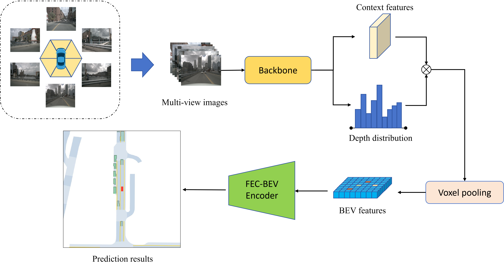
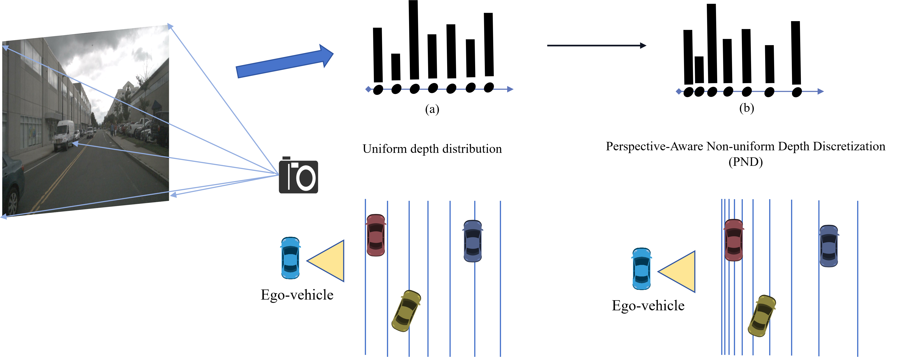
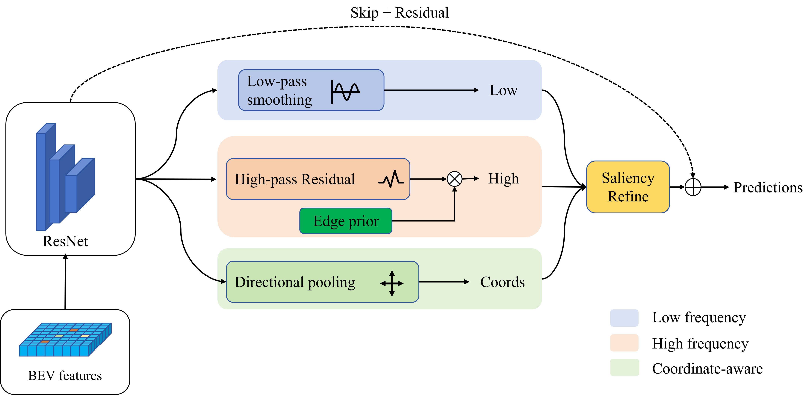

# :eyeglasses: GLAS-BEV: A Geometry-Aware Lifting and Structural Refinement Framework for Camera-Only BEV Perception

[](https://www.python.org/)
[](https://pytorch.org/)
[](LICENSE)

> **📢 TODO: The full codebase will be open-sourced upon paper acceptance. This repository currently serves as a preview of the project structure, model zoo results, and usage documentation.**

## To-do List

- [ ] Release full code
- [x] Preview

---

Official implementation of **"GLAS-BEV: A Geometry-Aware Lifting and Structural Refinement Framework for Camera-Only BEV Perception"**.

<p align="center">
  
</p>

## :memo: Abstract

Camera-only bird's-eye-view (BEV) perception offers a cost-effective solution for autonomous driving scene understanding, yet Lift-Splat-Shoot based methods often suffer from **inefficient depth sampling** during view transformation and **structural degradation** after BEV aggregation. This paper proposes **GLAS-BEV**, a geometry-aware lifting and structural refinement framework for single-frame multi-camera BEV segmentation.

- We propose **Perspective-Aware Non-uniform Depth Discretization (PND)**, which places depth-bin centers in the log-depth domain, allocating denser sampling to geometrically sensitive near-range regions without adding parameters.
- We propose **Frequency-Edge Cooperative BEV Refinement (FEC-BEV)** to enhance BEV features by jointly modeling low-frequency context, high-frequency boundary residuals, directional structures, edge priors, and parameter-free saliency.

Experiments on the nuScenes static vehicle BEV segmentation benchmark show that GLAS-BEV consistently improves the performance of lightweight LSS-style BEV perception while maintaining competitive accuracy against stronger baselines. The model runs at **76.1 FPS** with only **0.28 GiB** peak GPU memory, indicating a favorable balance between segmentation accuracy, inference speed, and memory efficiency.

### Overall framework

<p align="center">
  
</p>


---

## :sparkles: Proposed Modules

### PND — Perspective-Aware Non-uniform Depth Discretization

Instead of dividing the metric depth range uniformly, **PND** reallocates depth-bin centers in the log-depth domain so that near-range regions — which are geometrically more sensitive in the image-to-BEV transformation — receive denser sampling, while far-range regions are sampled more sparsely. The strategy introduces **no extra parameters** and leaves the LSS frustum and voxel-pooling interfaces unchanged, yet improves the geometric alignment between perspective-view features and the BEV plane.

<p align="center">
  
</p>


### FEC-BEV — Frequency-Edge Cooperative BEV Refinement

**FEC-BEV** performs lightweight structural refinement on the aggregated BEV feature before prediction. It uses three complementary branches — a low-pass smoothing branch for regional context, a high-pass residual branch combined with a fixed Sobel edge prior for boundary details, and a directional pooling branch for axis-aware structures. The fused output is modulated by a parameter-free SimAM saliency block and written back through a **zero-initialized residual** connection, so the module behaves as an identity at the start of training and learns refinement progressively.

<p align="center">
  
</p>


### Qualitative results

<p align="center">
  
</p>


---

## :hammer: Build Environments

**Requirements:** Python ≥ 3.8 · PyTorch ≥ 2.0 · CUDA ≥ 11.7

### Clone the repo

```bash
git clone https://github.com/tyjcbzd/GLAS-BEV.git
cd GLAS-BEV
```

### Create a conda environment

```bash
conda create -n glas_bev python=3.10 -y
conda activate glas_bev
```

### Install dependencies

```bash
pip install -r requirements.txt
```

---

## :open_hands: Data Preparation

### Download nuScenes

Register and download **nuScenes v1.0** from [nuscenes.org](https://www.nuscenes.org/download):

- **Trainval** split (blobs only)
- **Map expansion**

### Organize the directory

Extract everything into a single `data_nuscenes/` folder (set as `data.dataroot` in configs):

```
data_root/
├── maps/
│   ├── basemap/
│   └── expansion/
├── samples/
│   ├── CAM_BACK/
│   ├── CAM_BACK_LEFT/
│   ├── CAM_BACK_RIGHT/
│   ├── CAM_FRONT/
│   ├── CAM_FRONT_LEFT/
│   └── CAM_FRONT_RIGHT/
├── sweeps/
│   └── ...
├── v1.0-trainval/
│   ├── calibrated_sensor.json
│   ├── ego_pose.json
│   ├── sample.json
│   ├── sample_data.json
│   ├── scene.json
│   └── ...
└── v1.0-mini/          # optional, for quick sanity checks
```

---

## :paperclip: Model Zoo

> **📢 TODO: Checkpoint links will be added upon paper acceptance and code release.**

All models are evaluated on the nuScenes vehicle BEV segmentation benchmark with the EfficientNet-B4 backbone. IoU is reported under the **no-visibility-filtering** protocol.

### Full model

| Method   | Input   | IoU↑ |
| -------- | ------- | ---- |
| GLAS-BEV | 224×480 | 37.2 |
| GLAS-BEV | 448×800 | 39.9 |

### Module ablation (224×480, K = 41)

| PND  | FEC-BEV | IoU↑ |
| ---- | ------- | ---- |
| ✗    | ✓       | 35.5 |
| ✓    | ✗       | 35.8 |
| ✓    | ✓       | 37.2 |

---

## :rocket: Train from Scratch

All experiments use `train_pl.py` with a YAML config:

```bash
python train_pl.py --config <path/to/config.yaml>
```

---

## :white_check_mark: Test

```bash
python evaluate_pl.py --config configs/ablation/EN-b4_pand_4-45-41_fec_bev.yaml
```

The checkpoint path is read from `eval.ckpt_path` in the config, or can be overridden:

```bash
python evaluate_pl.py \
    --config xxxx.yaml \
    --ckpt_path xxxx.ckpt
```

---

## :pray: Acknowledgements

This project builds on the following outstanding works:

- **[Lift, Splat, Shoot](https://github.com/nv-tlabs/lift-splat-shoot)** — Jonah Philion & Sanja Fidler, ECCV 2020. Core view transformer and QuickCumsum voxel pooling.
- **[FIERY](https://github.com/wayveai/fiery)** — Anthony Hu et al., ICCV 2021. Static BEV segmentation baseline and evaluation protocol.
- **[PointBeV](https://github.com/valeoai/PointBeV)** — Valeo.ai. Evaluation protocol and baseline numbers under visibility filtering.

We also thank the [nuScenes](https://www.nuscenes.org/) team for the dataset and annotation tools.

---

## :mortar_board: Citation

in process...

*(BibTeX will be updated upon publication.)*
